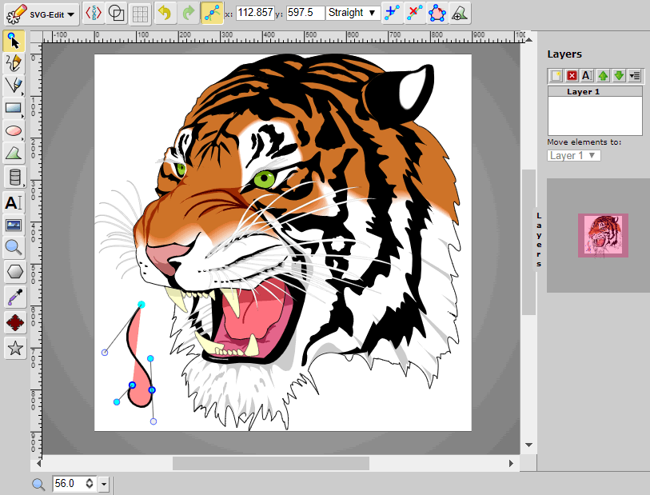

# SVGEdit

[](https://www.npmjs.com/package/svgedit)
[](https://github.com/SVG-Edit/svgedit/actions)
[](https://snyk.io/test/github/SVG-Edit/svgedit)
[](https://lgtm.com/projects/g/SVG-Edit/svgedit/alerts)
[](https://lgtm.com/projects/g/SVG-Edit/svgedit/context:javascript)

**SVGEdit** is a fast, web-based, JavaScript-driven SVG drawing editor that
works in any modern browser. **SVGEdit** is based on a powerful SVG canvas **@svgedit/svgcanvas**


[](https://upload.wikimedia.org/wikipedia/commons/f/fd/Ghostscript_Tiger.svg)

## Contributions

SVGEdit is the most popular open source SVG editor. It was started more than 13 years ago by a fantastic team of developers. Unfortunately, the product was not maintained for quite a long time. We decided to give this tool a new life by refreshing many aspects.

Please let us know by creating an issue or a discussion if you wish to contribute.

## I want to use SVGEdit

Thanks to **Netlify**, you can access the following builds from your favorite browser:

- [Try SVGEdit V7 (master branch on github)](https://svgedit.netlify.app/editor/index.html)
- [Try SVGEdit V7 (latest published version on npm)](https://unpkg.com/svgedit@latest/dist/editor/index.html)

### Prior to V7:

We recommend using the V7 version but for older browsers or some abandoned features, you may need to access older versions of SVGEdit.

- [Try SVGEdit 6.1.0 here](https://60a0000fc9900b0008fd268d--svgedit.netlify.app/editor/index.html)
- [Try SVGEdit 5.1.0 here](https://unpkg.com/svgedit@5.1.0/editor/svg-editor.html)

Additional tip: you may try a version released on NPM using `unpkg`, for example, with version 3.2.0

- [https://unpkg.com/svgedit@3.2.0/editor/svg-editor.html](https://unpkg.com/svgedit@3.2.0/editor/svg-editor.html)

## I want to host SVGEdit in my environment

If you want to host a local version of SVGEdit, please follow these instructions:

1. clone or copy the repository contents from github
1. run `npm i` to install dependencies
1. run `npm run build --workspace @svgedit/svgcanvas` to build the svgcanvas dependency locally
1. to test, you can run `npm run start` to start a local server
1. and access `http://localhost:8000/src/editor/index.html` with a supported browser
1. run `npm run build` to build a bundle that you can serve from your own web server

## I want to contribute to SVGEdit

**Thanks!**

SVGEdit is made of two major components:

1. The "svgcanvas" that takes care of the underlying svg editor. It can be used to build your own editor
1. The "editor" that takes care of the editor UI (menus, buttons, etc.)

You should fork SVGEdit in your github environment and install SVGEdit locally as explained above.

Before you submit your PR, please make sure you run locally:

1. `npm run lint` to check that you follow the standardjs rules (https://standardjs.com/rules) for the linter
1. `npm run test` to run a suite of Cypress tests (https://www.cypress.io/)

If you intend to contribute on a regular basis, let us know so we can add you to the maintainer team.

## I want to integrate SVGEdit into my own Web application

V7 is changing significantly the way to integrate and customize SVGEdit. You can have a look at `index.html` to see how you can insert a `div` element into your HTML code and inject the editor into the `div`.

**Warning: This `div` can be positioned anywhere in the DOM but it must have a numeric width and a numeric height (i.e. not 'auto' which happens when the `div` is hidden)**

```html
<head>
   <!-- You need to include the CSS for SVGEdit somewhere in your application -->
  <link href="./svgedit.css" rel="stylesheet" media="all"></link>
</head>

<body>
  <!-- svgedit container can be positioned anywhere in the DOM
       but it must have a width and a height -->
  <div id="container" style="width:100%;height:100vh"></div>
</body>
<script type="module">
  /* You need to call the Editor and load it in the <div> */
  import Editor from './Editor.js'
  /* for available options see the file `docs/tutorials/ConfigOptions.md` */
  const svgEditor = new Editor(document.getElementById('container'))
  /* set the configuration */
  svgEditor.setConfig({
          allowInitialUserOverride: true,
          extensions: [],
          noDefaultExtensions: false,
          userExtensions: []
  })
  /* initialize the Editor */
  svgEditor.init()
</script>
</html>
```

## I want to build my own svg editor
You can just use the underlying canvas and use it in your application with your favorite framework.
See example in the demos folder or the svg-edit-react repository.

To install the canvas:

`npm i -s '@svgedit/svgcanvas'`

you can then import it in your application:

`import svgCanvas from '@svgedit/svgcanvas'`

## Supported browsers

Development and Continuous Integration are done with a **Chrome** environment. Recent versions of Chrome, FireFox, and Safari are supported (in the meaning that we will try to fix bugs for these browsers).

To support old browsers, you may need to use an older version of the package. However, please open an issue if you need support for a specific version of your browser so that the project team can decide if we should support it in the latest version of SVGEdit.

## Sample extension based on React

A sample React component was used to build a SVGEdit extension.

To activate:

- "npm run build" from the extension folder "src/editor/react-extensions/react-test" in order to create the bundle for the extension.
- modify "index.html" to activate the extension as a `userExtensions`

```javascript
svgEditor.setConfig({
          allowInitialUserOverride: true,
          extensions: [],
          noDefaultExtensions: false,
          userExtensions: ['./react-extensions/react-test/dist/react-test.js']
        })
```

## Further reading and more information

- Participate in [discussions](https://github.com/SVG-Edit/svgedit/discussions)
- See [AUTHORS](AUTHORS) file for authors.
- [StackOverflow](https://stackoverflow.com/tags/svg-edit) group.

## Hosting

SVGEdit versions are deployed to:

[](https://www.netlify.com)

---

[⇈ Back to Top](#svgedit)
